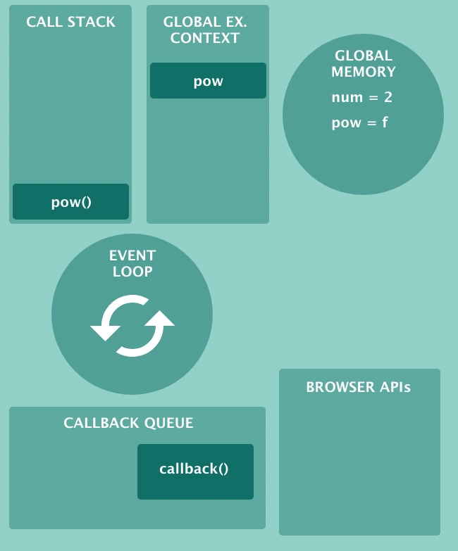

# JavaScript事件循环机制
```js
var num = 2;
function pow(num) {
    return num * num;
}
pow(num);
setTimeout(callback, 10000);
function callback(){
    console.log('hello timer!');
}
```



> 术语解析
+ CALL STACK [调用栈]
+ GLOBAL EX.CONTEXT [全局执行上下文]
+ GLOBAL MEMORY [全局内存，也叫做堆]
+ EVENT LOOP [事件循环]
+ CALLBACK QUEUE [回调队列]
+ BROWSER APIs [浏览器API]
+ 函数内部有一个**本地执行上下文**

https://github.com/qq449245884/xiaozhi/issues/68