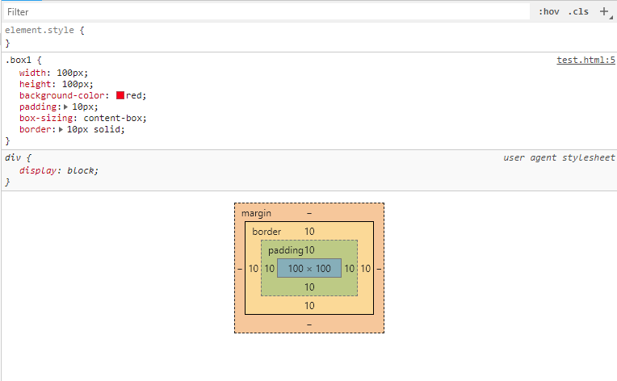
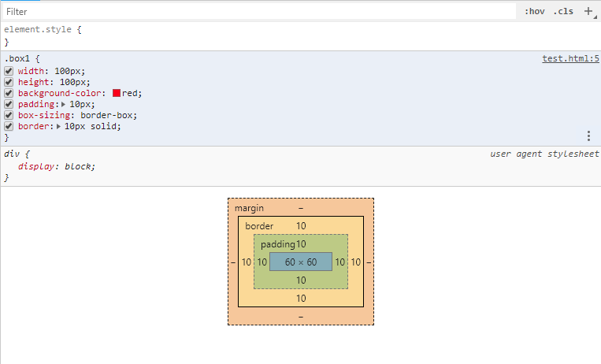

# CSS的盒模型

在CSS中，可以认为每一个HTML标签都作为一个方块。然后这个方块又包含着一个一个的小方块，如同盒子一般一层一层的包裹着。这就是盒模型。

在CSS中，盒模型有两种：

+ W3C标准盒模型(content-box)

+ IE盒模型(border-box)

> W3C标准盒模型

W3C标准盒模型:

    盒子的宽度 = 内容宽度

    盒子的高度 = 内容高度

如图所示:

内容的宽度和高度始终是盒子的宽度和高度

> IE盒模型(border-box)

IE盒模型:

    盒子的宽度 = 内容宽度 + 内边距宽度(padding) + 边框宽度(border) = 100

    盒子的高度 = 内容高度 + 内边距高度(padding) + 边框高度(border) = 100

如图所示:

内容的宽度和高度 = 内容 + 内边距(padding) + 边框(border)

注意:
    
    我们在编写页面代码时应尽量使用标准的W3C模型(需在页面中声明DOCTYPE类型)，这样可以避免多个浏览器对同一页面的不兼容。

    因为若不声明DOCTYPE类型，IE浏览器会将盒子模型解释为IE盒子模型，FireFox等会将其解释为W3C盒子模型；
    
    若在页面中声明了DOCTYPE类型，所有的浏览器都会把盒模型解释为W3C盒模型。