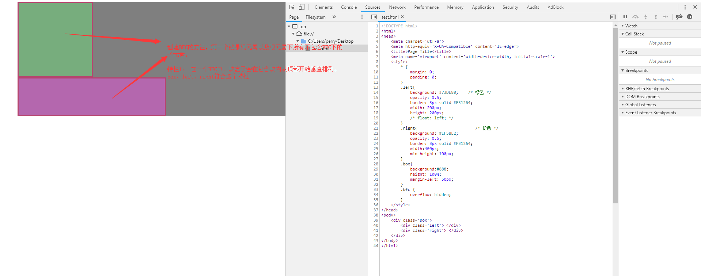
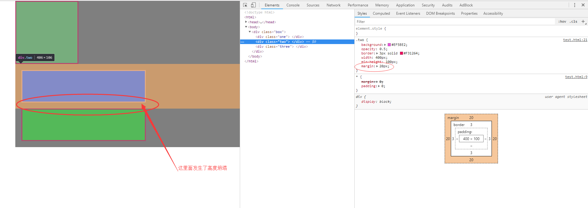
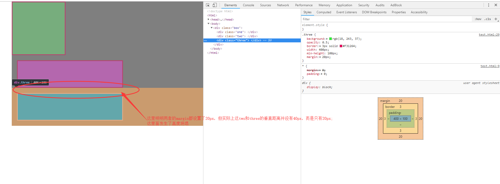
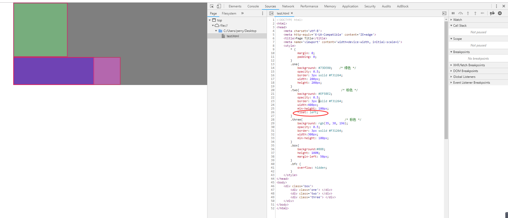
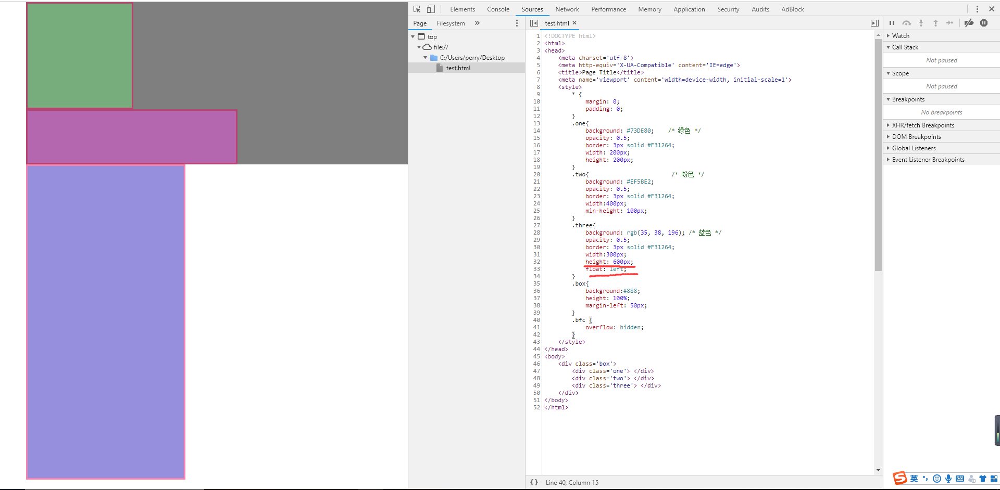
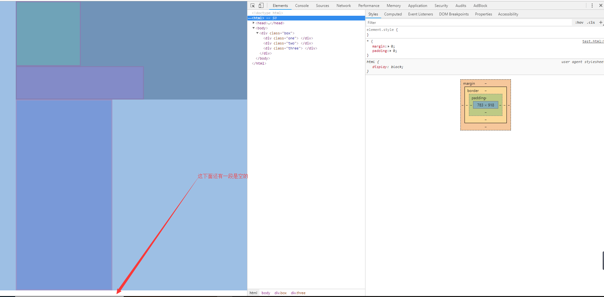
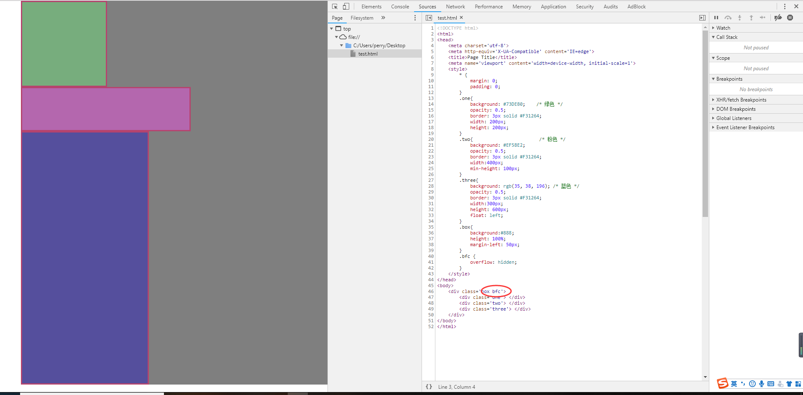

# 块级格式化上下文(BFC)

[参考1](https://juejin.im/post/59b73d5bf265da064618731d#heading-0)

[参考2](http://www.ayqy.net/doc/css2-1/visuren.html#block-formatting)

## 块级格式化上下文(Block Formatting Context 简称 BFC)

块级格式化上下文是CSS2.1规范定义的，一个关于CSS渲染定位的一个概念。

块级格式化上下文是决定`块盒`的布局和浮动互相影响范围的一个区域


### BFC创建方法

+ 根元素或其它包含它的元素
+ 浮动 (元素的`float`不为`none`)
+ 绝对定位的元素 (元素的`position`为`absolute`或`fixed`)
+ 行内块`inline-blocks`(元素的 `display: inline-block`)
+ 表格单元格(元素的`display: table-cell`，HTML表格单元格默认属性)
+ `overflow`的值不为`visible`的元素
+ 弹性盒 `flex boxes` (元素的`display: flex`或`inline-flex`)

最常见的就是`overflow:hidden`、`float:left/right`、`position:absolute`

### BFC的影响范围

> A block formatting context contains everything inside of the element creating it that is not also inside a descendant element that creates a new block formatting context.


BFC影响的范围是**包含创建该上下文元素的所有子元素**，但**不包含创建了新的BFC的子元素内部的子元素**

例子:

```html
<div id="D1" class="bfc">
    <div id="D2">
        <div id="D3"></div>
        <div id="D4"></div>
    </div>
    <div id="D5" class="bfc">
        <div id="D6"></div>
        <div id="D7"></div>
    </div>
    <div id="D8"></div>
</div>
```

如上例所示，D1创建了一个BFC，所以D1的BFC的覆盖范围是D2、D3、D4、D5、D8。即`包含创建该上下文元素的所有子元素`。

但是因为D5创建了一个新的BFC，所以D1不包含D6和D7，D6和D7的BFC上下文范围是属于D5的。即`不包含创建了新的BFC的子元素内部的子元素`

### BFC的特性

> In a block formatting context, boxes are laid out one after the other, vertically, beginning at the top of a containing block. The vertical distance between two sibling boxes is determined by the 'margin' properties. Vertical margins between adjacent block-level boxes in a block formatting context collapse.

> In a block formatting context, each box's left outer edge touches the left edge of the containing block (for right-to-left formatting, right edges touch). This is true even in the presence of floats (although a box's line boxes may shrink due to the floats), unless the box establishes a new block formatting context (in which case the box itself may become narrower due to the floats).

+ #1 在一个块格式化上下文中，从包含块的顶部开始， 盒在垂直方向一个接一个地放置

+ #2 两个兄弟盒之间的垂直距离由'margin'属性决定

+ #3 同一个块格式化上下文中，相邻的盒子之间的垂直外边距会合并 (即会出现 margin collapse)

+ #4 在一个块格式化上下文中, 每个盒的左外边界(left outer edge)紧挨着包含块(父级)的左外边界(从右的则挨着右外边界)

+ #5 BFC就是页面上的一个隔离的独立容器，容器里面的子元素不会影响到外面的元素，反之亦然

+ #6 计算BFC的高度时，考虑BFC所包含的所有元素，连浮动元素也参与计算

+ #7 浮动盒区域不叠加到BFC上

### 特性解析的例子

> #1 在一个块格式化上下文中，从包含块的顶部开始， 盒在垂直方向一个接一个地放置



> #3 同一个块格式化上下文中，相邻的盒子之间的垂直外边距会合并 (即会出现 margin collapse[高度坍塌])




补充一点，发生margin collapse，当以下条件符合的时候会出现：

+ 两个margin是相邻的, 水平的margin不会发生合并，但是垂直方向的margin符合下面规则的时候：

    + 都属于流内（in-flow）块盒，处于同一个块格式化上下文(BFC)中
    + 没有行框（line box），空隙，内边距和边框把它们隔开
    + 都属于垂直相邻框边界（vertically-adjacent box edges），即形成下列某一对：

        + 盒的上边距与其第一个流内（in-flow）孩子的上边距
        + 盒的下边距与其下一个流内紧挨着的兄弟的上边距
        + 最后一个流内孩子的下边距与其height计算值为'auto'的父元素的下边距
        + 盒的上边距和下边距，要求该盒没有建立新的块格式化上下文，并且'min-height'计算值为0，'height'计算值为0或'auto'，还没有流内孩子

> #4 在一个块格式化上下文中, 每个盒的左外边界(left outer edge)紧挨着包含块(父级)的左外边界(从右的则挨着右外边界)

> #7 浮动盒区域不叠加到BFC上



如图所示，box, one, three符合特性4(#4),每个盒子的左外边界都与父级的左外边界紧挨着。box紧挨body，one、three紧挨着box。


给two添加一个`float:left`属性用来添加一个BFC，这个时候two不受根元素的BFC影响，同时two和three重叠了，这也说明了特性7(#7),浮动的区域不会叠加到包含块的BFC上。

> #6 计算BFC的高度时，考虑BFC所包含的所有元素，连浮动元素也参与计算



现在加一点东西，给three高度撑大，并且让其创建一个BFC，向左float。可以看到，box的高度计算并不包括three的盒子。但因为特性6(#6)，根元素的高度计算是包含three的,如图:



更生动一点的表示，如果要让box的高度包含three的高度，只需要给box创建一个BFC就行了，如图: 



因为给box添加了一个`overflow: hidden`, 让其创建了一个BFC，所以这个时候的box高度是已经包含了three的高度了

### BFC的应用

+ 阻止margin重叠

        处于同一个BFC中的块级盒会发生垂直方向的margin重叠，如果要避免其重叠，则给子元素创建一个BFC就好了

+ 清除内部浮动

        清除浮动的原理是两个div都位于同一个 BFC 区域之中

+ 自适应两栏布局

+ 可以阻止元素被浮动元素覆盖