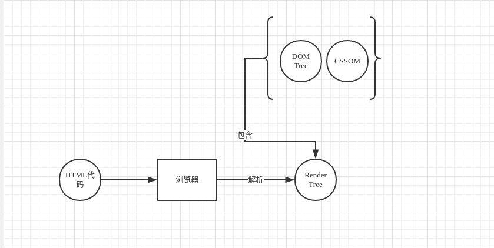

# CSS的重绘与回流

> 浏览器加载时做了什么?



  在页面加载时，浏览器把获取到的HTML代码解析成1个DOM树，DOM树里包含了所有HTML标签，包括display:none隐藏，还有用JS动态添加的元素等。

  浏览器把所有样式(用户定义的CSS和用户代理)解析成样式结构体,DOM Tree 和样式结构体组合后构建render tree,
  
  render tree类似于DOM tree，但区别很大，因为render tree能识别样式，render tree中每个NODE都有自己的style，而且render tree不包含隐藏的节点(比如display:none的节点，还有head节点)，因为这些节点不会用于呈现，而且不会影响呈现的，所以就不会包含到 render tree中.
    
  通俗的说: 
  + 浏览器采用流式布局模型（Flow Based Layout）
  + 浏览器会把HTML解析成DOM，把CSS解析成CSSOM，DOM和CSSOM合并就产生了渲染树（Render Tree）。
  + 有了RenderTree，我们就知道了所有节点的样式，然后计算他们在页面上的大小和位置，最后把节点绘制到页面上。
  + 由于浏览器使用流式布局，对Render Tree的计算通常只需要遍历一次就可以完成，***但table及其内部元素除外，他们可能需要多次计算，通常要花3倍于同等元素的时间，这也是为什么要避免使用table布局的原因之一。***

  渲染过程:
  + 解析HTML，生成DOM树，解析CSS，生成CSSOM树
  + 将DOM树和CSSOM树结合，生成渲染树(Render Tree)
  + Layout(回流):根据生成的渲染树，进行回流(Layout)，得到节点的几何信息（位置，大小）
  + Painting(重绘):根据渲染树以及回流得到的几何信息，得到节点的绝对像素
  + Display:将像素发送给GPU，展示在页面上

> 重绘:

  当render tree中的一些元素需要更新属性，而这些属性只是影响元素的外观，风格，而不会影响布局的，比如background-color。则就叫称为重绘。

  由于节点的几何属性发生改变或者由于样式发生改变而不会影响布局的，称为重绘，例如outline, visibility, color、background-color等，重绘的代价是高昂的，因为浏览器必须验证DOM树上其他节点元素的可见性。

> 回流:

  当render tree中的一部分(或全部)因为元素的规模尺寸，布局，隐藏等改变而需要重新构建。这就称为回流(reflow)，当页面布局和几何属性改变时就需要回流

  回流是布局或者几何属性需要改变就称为回流。回流是影响浏览器性能的关键因素，因为其变化涉及到部分页面（或是整个页面）的布局更新。一个元素的回流可能会导致了其所有子元素以及DOM中紧随其后的节点、祖先节点元素的随后的回流。

  ```html
  <body>
    <div class="error">
        <h4>我的组件</h4>
        <p><strong>错误：</strong>错误的描述…</p>
        <h5>错误纠正</h5>
        <ol>
            <li>第一步</li>
            <li>第二步</li>
        </ol>
    </div>
  </body>
  ```
    在上面的HTML片段中，对该段落(<p>标签)回流将会引发强烈的回流，因为它是一个子节点。
    这也导致了祖先的回流（div.error和body – 视浏览器而定）。
    此外，<h5>和<ol>也会有简单的回流，因为其在DOM中在回流元素之后。
    大部分的回流将导致页面的重新渲染。

> 回流和重绘的关系:

  + 回流必将引起重绘
  + 而重绘不一定会引起回流

  ***回流必定会发生重绘，重绘不一定会引发回流。***


>  浏览器优化

现代浏览器大多都是通过队列机制来批量更新布局，浏览器会把修改操作放在队列中，至少一个浏览器刷新（即16.6ms）才会清空队列，但当你**获取布局信息的时候，队列中可能有会影响这些属性或方法返回值的操作，即使没有，浏览器也会强制清空队列，触发回流与重绘来确保返回正确的值。**

主要包括以下属性或方法：

+ offsetTop、offsetLeft、offsetWidth、offsetHeight
+ scrollTop、scrollLeft、scrollWidth、scrollHeight
+ clientTop、clientLeft、clientWidth、clientHeight
+ width、height
+ getComputedStyle()
+ getBoundingClientRect()

所以，我们应该避免频繁的使用上述的属性，他们都会强制渲染刷新队列。

> 减少重绘与回流

1.CSS
  + **使用 transform 替代 top**
  + **使用 visibility 替换 display: none** ，因为前者只会引起重绘，后者会引发回流（改变了布局)
  + **避免使用table布局**，可能很小的一个小改动会造成整个 table 的重新布局。
  + **尽可能在DOM树的最末端改变class**，回流是不可避免的，但可以减少其影响。尽可能在DOM树的最末端改变class，可以限制了回流的范围，使其影响尽可能少的节点。
  + **避免设置多层内联样式**，CSS 选择符**从右往左**匹配查找，避免节点层级过多。
  ```html
  <div>
    <a> <span></span> </a>
  </div>
  <style>
    span {
      color: red;
    }
    div > a > span {
      color: red;
    }
  </style>
  ```
  对于第一种设置样式的方式来说，浏览器只需要找到页面中所有的 span 标签然后设置颜色，但是对于第二种设置样式的方式来说，浏览器首先需要找到所有的 span 标签，然后找到 span 标签上的 a 标签，最后再去找到 div 标签，然后给符合这种条件的 span 标签设置颜色，这样的递归过程就很复杂。所以我们应该尽可能的避免写过于具体的 CSS 选择器，然后对于 HTML 来说也尽量少的添加无意义标签，保证层级扁平。

  + **将动画效果应用到position属性为absolute或fixed的元素上**，避免影响其他元素的布局，这样只是一个重绘，而不是回流，同时，控制动画速度可以选择 requestAnimationFrame，详见探讨 requestAnimationFrame。
  + **避免使用CSS表达式，可能会引发回流。**
  + **将频繁重绘或者回流的节点设置为图层**，图层能够阻止该节点的渲染行为影响别的节点，例如will-change、video、iframe等标签，浏览器会自动将该节点变为图层。
  + **CSS3 硬件加速（GPU加速）**，使用css3硬件加速，可以让transform、opacity、filters这些动画不会引起回流重绘 。但是对于动画的其它属性，比如background-color这些，还是会引起回流重绘的，不过它还是可以提升这些动画的性能。

> JavaScript

+ **避免频繁操作样式**，最好一次性重写style属性，或者将样式列表定义为class并一次性更改class属性。
+ **避免频繁操作DOM**，创建一个documentFragment，在它上面应用所有DOM操作，最后再把它添加到文档中。
+ **避免频繁读取会引发回流/重绘的属性**，如果确实需要多次使用，就用一个变量缓存起来。
+ **对具有复杂动画的元素使用绝对定位**，使它脱离文档流，否则会引起父元素及后续元素频繁回流。

> 具体理解

[介绍下重绘和回流（Repaint & Reflow），以及如何进行优化](https://github.com/Advanced-Frontend/Daily-Interview-Question/issues/24)