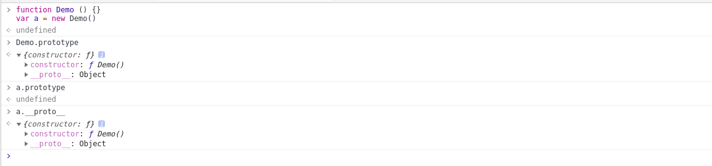
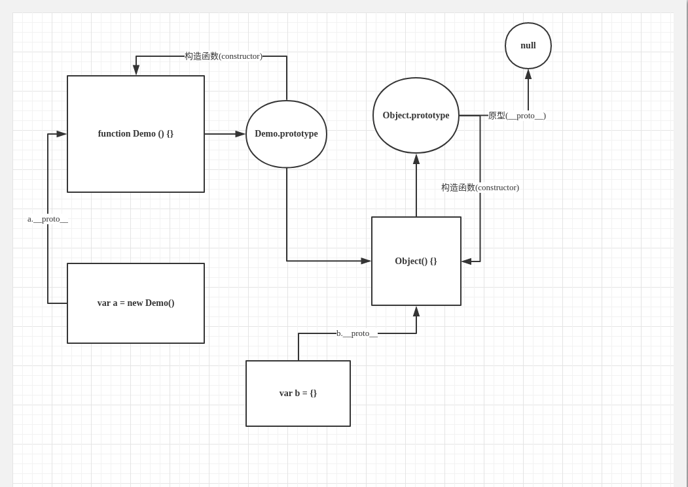
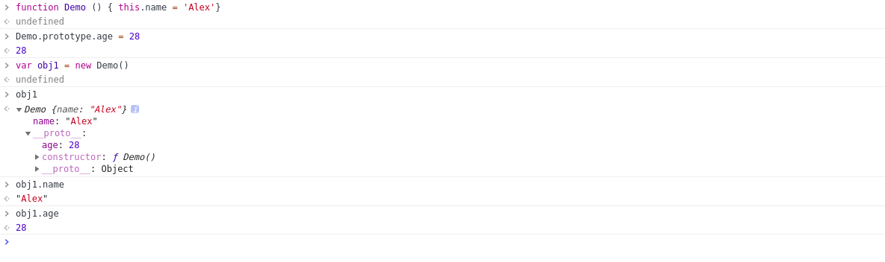
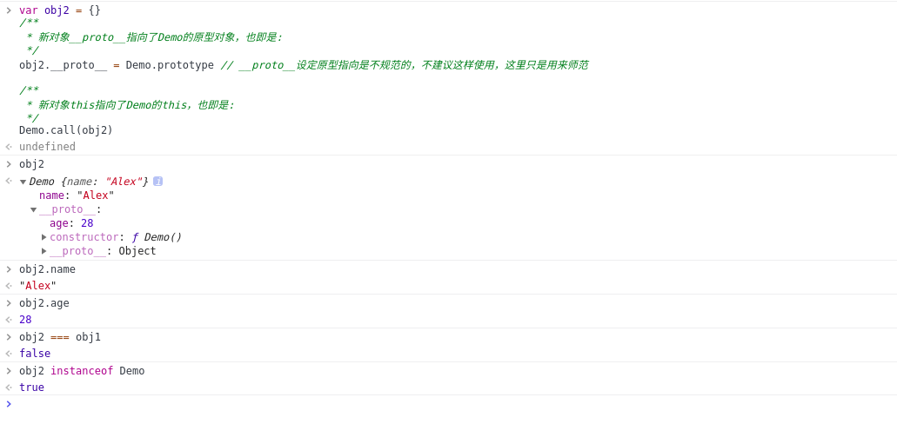

# 原型链与继承


## 原型

JavaScript是一种**基于原型的语言 (prototype-based language)**————每个对象拥有一个**原型对象**，对象以其原型为模板、从原型继承方法和属性。原型对象也可能拥有原型，并从中继承方法和属性。这种一层一层的关系叫做**原型链(prototype chain)**

*在JavaScript中，每一个**函数**都有一个**特殊的属性(prototype)**，叫做**原型***

**每个构造函数(constructor)都有一个原型对象(prototype),原型对象都包含一个指向构造函数的指针,而实例(instance)都包含一个指向原型对象的内部指针.**

```js
  // 函数创建的对象
  function Demo () {}
  var a = new Demo()
```



`Demo`函数的**原型对象**是`prototype`，原型对象内有一个`constructor`(构造函数)属性和一个`__proto__`(原型链指向)属性。`a`对象只有一个`__proto__`,指向`demo`的`prototype`。

+ `prototype`: 函数的原型对象( **注意:这玩意只有函数才有** )

+ `constructor`: 构造函数

+ `__proto__`: **实例对象的私有属性，指向它构造函数的原型**（简单理解就是原型指向，指针，或者其他什么的，就是一个指向它原型的一个东西, **注意：这玩意只要是一个实例对象，就会有这个私有属性**）



所以，根据以上理解起来就是： 函数都有一个原型对象，这个对象指向函数的原型。对象没有`prototype`原型对象，但是有一个私有的`__proto__`指向这个对象的原型

## new运算符都做了些什么?

看下以下代码

```js
function Demo () {
  this.name = 'Alex'
}

Demo.prototype.age = 28

var obj1 = new Demo()
```

这个时候，打印以下obj1



也就是说，new 的时候，将一个新对象返回给了obj1，这个新对象的原型是Demo, 并且this指向了Demo。

```js
// 模拟new
function Demo () {
  this.name = 'Alex'
}

Demo.prototype.age = 28

var obj2 = {}
/**
 * 新对象__proto__指向了Demo的原型对象，也即是:
 */
obj2.__proto__ = Demo.prototype // __proto__设定原型指向是不规范的，不建议这样使用，这里只是用来师范

/**
 * 新对象this指向了Demo的this，也即是:
 */
Demo.call(obj2)
```
结果



## 简单粗暴的实现一个继承

```js

function MyObj() {
  this.name = 'age'
  this.sex = '男'
}
MyObje.prototype.sayHi = function () { console.log('Hello!') }

var obj1 = new MyObj()

// 继承开始
var obj2 = {}
obj2.__proto__ = obj1
obj1.__proto__.constructor.call(obj2)

obj2.show()
obj2.name

// 以上最好用Object.create()来代替
```