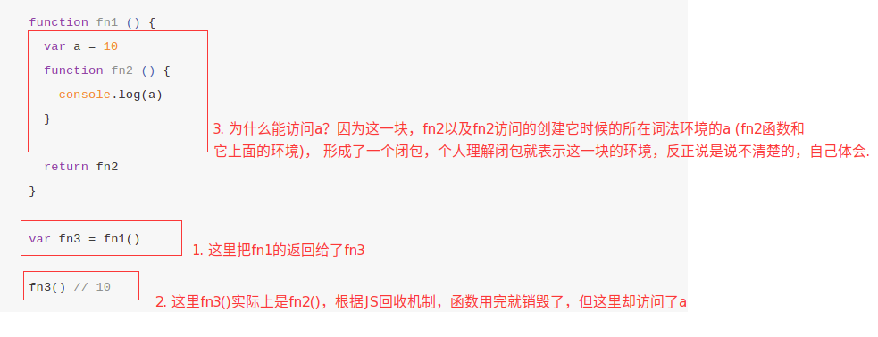

# 闭包

## 什么是闭包?

《JavaScript高级程序设计》:

> 闭包是指有权访问另一个函数作用域中的变量的函数；


《JavaScript权威指南》:

> 从技术的角度讲，所有的JavaScript函数都是闭包：它们都是对象，它们都关联到作用域链。


《你不知道的JavaScript》:

> 当函数可以记住并访问所在的词法作用域时，就产生了闭包，即使函数是在当前词法作用域之外执行。

总结:

> 闭包是指函数有权访问另一个函数作用域中的变量，满足两个特征。
> 1. 是一个**函数**
> 2. 这个函数可以访问**创建它时**的**词法作用域中**的所有**可访问变量**(包括私有变量，参数等)

**例子1:**

```js
  function fn1 () {
    var a = 10
    function fn2 () {
      console.log(a)
    }

    return fn2
  }

  var fn3 = fn1()

  fn3() // 10
```


fn2的词法作用域能够访问fn1， fn3是函数fn2本身，执行fn3能够正常的输出10, 这是因为fn2记住了并且访问了它所在的词法作用域，并且fn2函数的运行还是在词法作用域之外执行的。所以 fn2和它的词法作用域就组成了一个闭包.

**例子2**

```js
  function waitTimeout () {
    for (var i = 0; i < 10; i++) {
      setTimeout(function () {
        console.log(i)
      }, 1000)
    }
  }

  waitTimeout()
```

在上面的例子中，我们预期是打印0-10，但实际上打印出来的却是10次10.为什么会这样呢? 这是因为setTimeout里面的回调函数与waitTimeout的里面的作用域构成了一个闭包，所以，setTimeout里面的回调函数会直接访问到的是外层作用域变量最后的结果。

知道原因了，便可以根据原因去修改，只需要给setTimeout内的函数一个私有的作用域，便可以解决这个问题。

```js

  function waitTimeout () {
    for (var i = 0; i < 10; i++) {
      (function (j) {
        setTimeout(function () {
          console.log(i)
        }, 1000)
      })(i)
    }
  }

  waitTimeout()
```

这个时候的setTimeout的回调函数，会与外面的匿名函数构成一个闭包，此时的私有作用域便不会再受外面的影响

## 怎么创建一个闭包?

通过上面可以知道，闭包是由函数，以及函数所在的词法环境构成的。所以创建一个闭包最简单的形式就是:

```js
  function fn1 () {
    function fn2 () {
      console.log('哈哈哈')
    }
    return fn2
  }
```
## 闭包的应用

闭包的应用比较典型是定义模块，我们将操作函数暴露给外部，而细节隐藏在模块内部：

```js
function module() {
	var arr = [];
	function add(val) {
		if (typeof val == 'number') {
			arr.push(val);
		}
	}
	function get(index) {
		if (index < arr.length) {
			return arr[index]
		} else {
			return null;
		}
	}
	return {
		add: add,
		get: get
	}
}
var mod1 = module();
mod1.add(1);
mod1.add(2);
mod1.add('xxx');
console.log(mod1.get(2));

```

单例模式:

```js
var singleton = (function(){
  
  // 私有变量
  var age = 22;
  var speak = function(){
    console.log("speaking!!!");
  };
  
  // 特权（或公有）属性和方法
  return {
    name: "percy",
    getAge: function(){
      return age;
    }
  };
})();
```

匿名函数最大的用途是创建闭包，并且还可以构建命名空间，以减少全局变量的使用。从而使用闭包模块化代码，**减少全局变量的污染**。

```js
var objEvent = objEvent || {};
(function(){ 
    var addEvent = function(){ 
      // some code
    };
    function removeEvent(){
      // some code
    }

    objEvent.addEvent = addEvent;
    objEvent.removeEvent = removeEvent;
})();
```

在这段代码中函数 addEvent 和 removeEvent 都是局部变量，但我们可以通过全局变量 objEvent 使用它，这就大大减少了全局变量的使用，增强了网页的安全性。

## 闭包的缺点

+ 闭包的缺点就是常驻内存会增大内存使用量，并且使用不当很容易造成内存泄露。

+ 如果不是因为某些特殊任务而需要闭包，在没有必要的情况下，在其它函数中创建函数是不明智的，因为闭包对脚本性能具有负面影响，包括处理速度和内存消耗。

## 闭包的一个题目

```js
function fun(n,o){
  console.log(o);
  return {
    fun: function(m){
      return fun(m,n);
    }
  };
}

var a = fun(0);  // ?
a.fun(1);        // ?        
a.fun(2);        // ?
a.fun(3);        // ?

var b = fun(0).fun(1).fun(2).fun(3);  // ?

var c = fun(0).fun(1);  // ?
c.fun(2);        // ?
c.fun(3);        // ?

```

> undefined

> 0

> 0

> 0

> undefined, 0, 1, 2

> undefined, 0

> 1

> 1

## 参考链接
[参考1](https://segmentfault.com/a/1190000006875662#articleHeader4)

[参考2](https://juejin.im/post/5b081f8d6fb9a07a9b3664b6#heading-5)