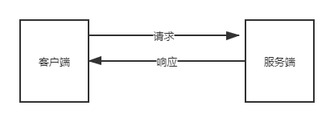

## HTTP与HTTPS协议

> 概念 :
  
  + **HTTP:** HTTP是***超文本传输协议***（英文：HyperText Transfer Protocol，缩写：HTTP），<u>是一种应用于分布式、协作式和超媒体信息系统的应用层协议</u>。HTTP是万维网的基础。

  + **HTTPS:** HTTPS是一种***超文本传输安全协议***（英语：Hypertext Transfer Protocol Secure，缩写：HTTPS，常称为HTTP over TLS，HTTP over SSL或HTTP Secure）<u>是一种通过计算机网络进行安全通信的传输协议</u>。HTTPS经由HTTP进行通信，但利用SSL/TLS来加密数据包。HTTPS开发的主要目的，是提供对网站服务器的身份认证，保护交换数据的隐私与完整性。

> 区别 :

  HTTP传输的数据都是未经加密的明文数据，并且无状态无身份认证，会存在一定的安全隐患。HTTPS是基于HTTP进行通信，但是对HTTP传输的内容使用了SSL/TLS的混合加密技术进行加密，并且有状态和身份认证。也就是说，HTTPS是HTTP + SSL/TLS构建的一种可进行加密传输、身份认证的网络协议，比HTTP更加的安全。

  具体的区别如下:

  + <u>HTTPS协议需要ca申请书进行信任校验，HTTP则不需要，它的每次请求都是独立的，所以服务端经常会使用Session或者Cooiket进行信任校验。</u>

  + <u>HTTP以明文的方式传输数据，HTTPS则使用SSL加密传输。</u>

  + <u>HTTP与HTTPS使用完全不同的连接方式，用的端口号也不一样。HTTP一般为80(或8080)，而HTTPS则是使用443端口。</u>

  + <u>HTTP连接简单，无状态，无身份验证。HTTPS则的客户端与服务端都会有一对自己的非对称秘钥(公钥、私钥)，两端之间使用对方的公钥对信息进行加密，接收方则会使用自己的私钥对接收到的信息进行解密。所以，HTTPS是有状态和身份验证的一种传输协议，比HTTP更加的安全。</u>

  总得来说，HTTPS比HTTP更加的安全。

> HTTP相关 :

1. #### OSI七层协议模型

    <table border="2">
      <tr>
        <td>OSI七层网络模型</td>
        <td>TCP/IP四层概念模型</td>
        <td>对应的网络协议</td>
      </tr>
      <tr>
        <td>应用层（Application）</td>
        <td rowspan="3">应用层</td>
        <td>HTTP、TFTP, FTP, NFS, WAIS、SMTP</td>
      </tr>
      <tr>
        <td>表示层（Presentation）</td>
        <td>Telnet, Rlogin, SNMP, Gopher</td>
      </tr>
      <tr>
        <td>会话层（Session）</td>
        <td>SMTP, DNS</td>
      </tr>
      <tr>
        <td>传输层（Transport）</td>
        <td>传输层</td>
        <td>TCP, UDP</td>
      </tr>
      <tr>
        <td>网络层（Network）</td>
        <td>网络层</td>
        <td>IP, ICMP, ARP, RARP, AKP, UUCP</td>
      </tr>
      <tr>
        <td>数据链路层（Data Link）</td>
        <td rowspan="2">数据链路层</td>
        <td>FDDI, Ethernet, Arpanet, PDN, SLIP, PPP</td>
      </tr>
      <tr>
        <td>物理层（Physical）</td>
        <td>IEEE 802.1A, IEEE 802.2到IEEE 802.11</td>
      </tr>
    </table>

    OSI七层网络模型后续放一个章节讲

    由上面表格可以看出，HTTP在TCP/IP四层模型中处于应用层

2. #### HTTP请求响应模型与工作过程

    请求响应模型：

    

    HTTP是一个无状态的协议，所谓无状态是指，客户机(WEB浏览器)和服务器之间不需要建立持久的连接，当客户端向服务器发送一个请求(Request),服务器接受到请求返回响应(Response),之后连接就被关闭了，服务器不会保留这个请求的相关连接信息。
    HTTP遵循请求（Request）/ 应答（Response）模型，客户端向服务器发送一个请求，服务器返回响应的应答，所有的HTTP连接都被构成一套请求和响应。

    HTTP工作过程：

    1. 对网址进行DNS域名解析，得到这个网站的IP地址
    
    2. 根据这个IP地址找到对应的服务器，发起TCP的三次握手

    3. 建立TCP连接之后发起HTTP请求

    4. 服务器响应HTTP的请求(Response)，浏览器得到网站代码

    5. 浏览器解析代码并渲染

3. #### TCP的三次握手

    TCP三次握手，是指在发起TCP连接的时候，客户端需要给服务端发送三个包

    

    [图片来源: https://www.cnblogs.com/zmlctt/p/3690998.html](https://www.cnblogs.com/zmlctt/p/3690998.html)

    第一次握手:
      客户端发送一个TCP的SYN标志位置1的包指明客户打算连接的服务器的端口，以及初始序号X,保存在包头的序列号(Sequence Number)字段里。

    第二次握手:
      服务器发回确认包(ACK)应答。即SYN标志位和ACK标志位均为1同时，将确认序号(Acknowledgement Number)设置为客户的I S N加1以.即X+1。

    第三次握手
      客户端再次发送确认包(ACK) SYN标志位为0,ACK标志位为1.并且把服务器发来ACK的序号字段+1,放在确定字段中发送给对方.并且在数据段放写ISN的+1

4. #### TCP的四次挥手

    

    [图片来源: https://www.cnblogs.com/zmlctt/p/3690998.html](https://www.cnblogs.com/zmlctt/p/3690998.html)
